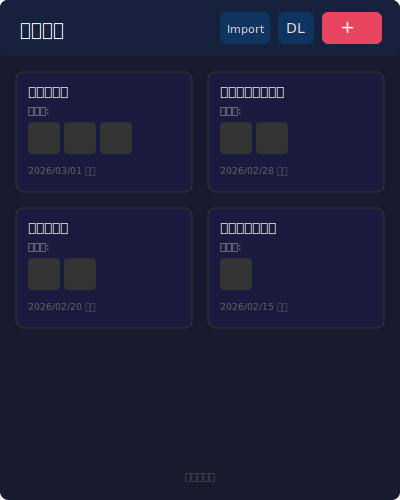
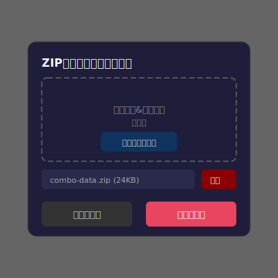
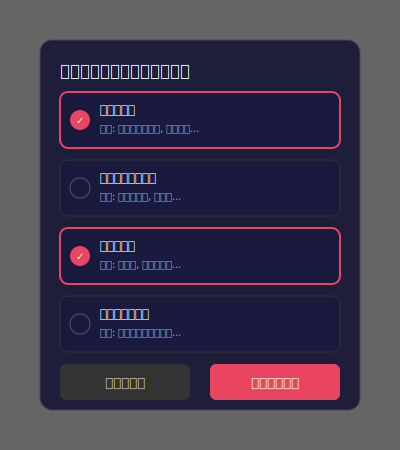
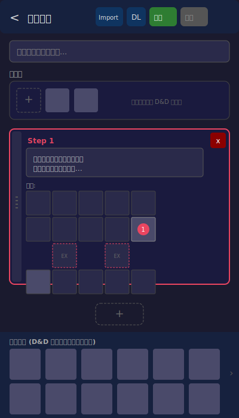
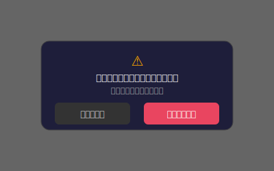
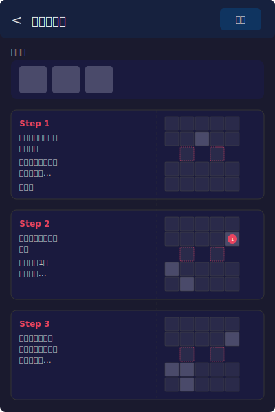

# 画面設計書

## 画面一覧

| No | 画面名 | パス | 説明 |
|----|--------|------|------|
| 1 | ホーム画面 | `/` | 展開一覧表示 (タイトル:「遊戯王 展開ログ」) |
| 2 | 展開作成画面 | `/combo/new` | 新規展開作成 |
| 3 | 展開編集画面 | `/combo/:id/edit` | 既存展開編集 |
| 4 | 展開詳細画面 | `/combo/:id` | 展開閲覧 (読み取り専用) |
| 5 | 共有展開画面 | `/share?d=<encoded>` | URL共有された展開のインポート (画像解決→IndexedDB保存→詳細画面リダイレクト) |

## モーダル一覧

| No | モーダル名 | 表示元画面 | 説明 |
|----|-----------|-----------|------|
| M1 | インポートモーダル | ホーム / 作成・編集 | ZIPファイルアップロード |
| M2 | ダウンロードモーダル | ホーム | 展開選択してZIPダウンロード |
| M3 | 未保存警告モーダル | 作成・編集 | 保存せず離脱時の確認 |
| M4 | 削除確認モーダル | 作成・編集 / 詳細 | 展開削除時の確認 |
| M5 | 設定モーダル | ホーム | チュートリアルのリセット管理 |
| M6 | 共有モーダル | 詳細 | 共有URL表示 + コピーボタン |

## ワイヤーフレーム一覧

| ファイル | 対象 |
|---------|------|
| [wireframes/home.svg](wireframes/home.svg) | ホーム画面 |
| [wireframes/modal-import.svg](wireframes/modal-import.svg) | インポートモーダル |
| [wireframes/modal-download.svg](wireframes/modal-download.svg) | ダウンロードモーダル |
| [wireframes/combo-edit.svg](wireframes/combo-edit.svg) | 展開作成・編集画面 |
| [wireframes/modal-unsaved.svg](wireframes/modal-unsaved.svg) | 未保存警告モーダル |
| [wireframes/combo-detail.svg](wireframes/combo-detail.svg) | 展開詳細画面 |

---

## 1. ホーム画面

### ワイヤーフレーム



### 画面仕様

| 要素 | 説明 |
|------|------|
| ヘッダ | タイトル「遊戯王 展開ログ」、インポート / ダウンロード / + / 設定ボタン |
| 展開カード | タイトル、初動札サムネイル、更新日時を表示。クリックで詳細画面へ遷移 |
| カードレイアウト | 2カラムのグリッド表示 |

### ヘッダボタンの動作

| ボタン | 動作 | スタイル |
|--------|------|---------|
| インポート | インポートモーダル (M1) を開く | 青色 |
| ダウンロード | ダウンロードモーダル (M2) を開く | 青色 |
| + | `/combo/new` に遷移 | 青色 (インポート等と同色) |
| 設定 (歯車) | 設定モーダルを開く | グレー |

---

## 1-M1. インポートモーダル (ホーム)

### ワイヤーフレーム



### モーダル仕様

| 要素 | 状態 | 説明 |
|------|------|------|
| ドロップゾーン | 初期状態 | D&D またはファイル選択で ZIP をアップロード |
| ファイル情報 | ZIP アップロード後 | ファイル名とサイズを表示 |
| ゴミ箱ボタン | ZIP アップロード後に活性化 | アップロードした ZIP を破棄 |
| インポートボタン | ZIP アップロード後に活性化 | マージ処理を実行しモーダルを閉じる |
| キャンセルボタン | 常時活性 | モーダルを閉じる |

---

## 1-M2. ダウンロードモーダル (ホーム)

### ワイヤーフレーム



### モーダル仕様

| 要素 | 説明 |
|------|------|
| 展開カード一覧 | タイトルと初動札をカード表示。クリックで選択/解除をトグル |
| 選択状態 | チェックマーク + 枠線色変更で表現 |
| ダウンロードボタン | 1つ以上選択時に活性化。選択した展開 + 関連画像を ZIP 化してダウンロード |
| キャンセルボタン | モーダルを閉じる |

---

## 2. 展開作成・編集画面

### ワイヤーフレーム



### 画面仕様

#### ヘッダ

| ボタン | 動作 | 状態 |
|--------|------|------|
| 戻る矢印 | ホーム画面 or 詳細画面に戻る。未保存時は M3 警告モーダルを表示 | 常時活性 |
| インポート | インポートモーダル (M1) を開く | 常時活性 |
| ダウンロード | 現在の展開 + 画像を ZIP ダウンロード | 常時活性 |
| 保存 | IndexedDB に保存。新規作成時は詳細画面へ遷移、編集時は詳細画面へ遷移 | 常時活性 |
| 削除 | 確認モーダル (M4) 表示後、展開を削除してホーム画面に戻る | 編集時のみ活性 (新規作成時は非活性)。赤色ボタン |

#### タイトル入力

- テキスト入力フィールド
- プレースホルダー:「展開タイトルを入力...」

#### NEURON URL 入力

- テキスト入力フィールド + 「取得」ボタン
- Neuron デッキURLを入力して取得ボタンを押すと、デッキ内のカード画像を一括取得して画像一覧に追加
- 取得中は「取得中...」と表示しボタンを非活性化
- エラー時はフィールド下にエラーメッセージを赤色で表示
- 入力したURLは `Combo.neuronUrl` として保存される
- 既存展開の編集時、neuronUrlが設定済みの場合はページ表示時に自動でNeuron画像を取得 (cid重複排除付き)

#### 画像の展開間分離

- 画像一覧には現在編集中の展開に属する画像のみ表示 (`comboImageIds` で管理)
- 画像追加・インポート・Neuron取得時に展開の画像IDセットに追加
- 「クリア」は現在の展開の画像のみクリア

#### 初動札セクション

- 画面下部の画像一覧から D&D で配置
- 横並びで画像サムネイルを表示
- 配置済み画像は常時表示のバツボタン (h-6 w-6) で削除可能 (スマホ対応)

#### インタラクティブカードコンポーネント

| 要素 | 説明 |
|------|------|
| ドラッグハンドル | 左端。掴んで D&D でカード並び替え |
| ゴミ箱ボタン | 右上。カードを削除 |
| ステップ番号 | 自動採番 (Step 1, 2, ...) |
| テキスト入力 | カード選択時に編集可能。選択中は枠線をハイライト |
| 盤面 (5x5 SVG) | 画面下部の画像を D&D で配置 |
| + ボタン | カード一覧末尾。新しいステップを追加 |

#### 盤面 (5x5 グリッド)

```
Row 0: [■][■][■][■][■]  ← 相手の魔法・罠ゾーン
Row 1: [■][■][■][■][■]  ← 相手モンスターゾーン
Row 2: [　][■][　][■][　]  ← EXモンスターゾーン (col 1, 3 のみ)
Row 3: [■][■][■][■][■]  ← 自分モンスターゾーン
Row 4: [■][■][■][■][■]  ← 自分の魔法・罠ゾーン
```

##### カードの表示比率

すべてのカード画像は **86:59 (縦:横)** の縦長の長方形で表示する。

##### ドラッグ&ドロップ

- 画像一覧からカードをドラッグする際、**DragOverlay** でカード画像がマウスに追従して表示される
- ドロップ先のハイライトは **すべてのステップの盤面セル** に表示される (ステップ選択不要)
- D&D で配置されたカードは常に **攻撃表示 (縦)** として配置される

##### 盤面上の画像操作

配置済み画像をクリックすると、バッジメニューを表示:

| 要素 | 動作 |
|--------|------|
| チェーン追加 | チェーンが未設定の場合に表示。現在の最大チェーン番号 + 1 を割り当てる |
| チェーン数値編集 | チェーンが設定済みの場合に表示。中央にチェーン番号、左右に **−** / **+** ボタン、右端に **×** (チェーン削除) ボタン。+ボタンで+1、−ボタンで−1 (最小値: 1) |
| 攻撃表示 / 守備表示 | カードの表示形式を切り替える。攻撃表示=縦、守備表示=横 |
| 削除 | 画像をセルから除去 |
| 閉じる | バッジメニューを閉じる |

#### 画面下部 固定画像一覧 (ボトムシート)

- 画面下部に固定表示 (position: fixed)、ボトムシート形式で開閉可能
- ハンドルバー: 「画像一覧 (枚数)」+ ▲/▼アイコン。タップで開閉トグル
- 開閉アニメーション: `grid-template-rows` によるスライド (300ms ease-in-out)
- 閉じた時: ハンドルバーのみ表示。コンテンツ領域のパディングは `pb-20` に縮小
- 開いた時: 2行構成、横スクロール可能。コンテンツ領域のパディングは `pb-64 sm:pb-80`
- D&D で盤面・初動札に配置
- D&D 後も画像一覧から消えない (何度でも使用可能)
- 「追加」ボタン: ファイル選択で画像を追加
- 「URL」ボタン: URL入力欄を表示し、外部画像URLから画像を追加 (CORS回避のためfetchせず外部URLを直接参照)
- 「クリア」ボタン: 画像一覧を全てクリア (画像が1つ以上あるときのみ表示)
- 削除ゾーン: 右側約1/5のスペースにゴミ箱アイコン付きのドロップゾーンを表示。画像をD&Dすると画像一覧から削除される (画像が1つ以上あるときのみ表示)

---

## 2-M1. インポートモーダル (作成・編集)

ホームのインポートモーダルと同じ UI だが、動作が異なる。

| 要素 | 説明 |
|------|------|
| ZIP アップロード | D&D またはファイル選択 |
| インポートボタン | ZIP 内の JSON から展開を読み込み画面に反映。画像はキャッシュ (画面下部) に追加。モーダルを閉じる |
| キャンセルボタン | モーダルを閉じる |

---

## 2-M3. 未保存警告モーダル

### ワイヤーフレーム



### モーダル仕様

| ボタン | 動作 |
|--------|------|
| キャンセル | モーダルを閉じて編集画面に留まる |
| 保存せず戻る | 変更を破棄して遷移元に戻る |

---

## 3. 展開詳細画面

### ワイヤーフレーム



### 画面仕様

| 要素 | 説明 |
|------|------|
| ヘッダ | 戻る矢印 (ホーム画面へ)、展開タイトル、共有 / ダウンロード / 編集 / 削除ボタン |
| 初動札 | 画像サムネイルを横並び表示 (読み取り専用) |
| ステップカード | 左側にテキスト、右側に縮小盤面を配置。チェーン番号も表示 |
| 共有ボタン | 共有モーダル (M6) を開く。Combo → ShareData → pako deflate → Base64url → URL を生成 |
| ダウンロードボタン | 展開 + 関連画像を ZIP ダウンロード |
| 編集ボタン | `/combo/:id/edit` に遷移 |
| 削除ボタン | 確認モーダル表示後、展開を削除してホーム画面に遷移 |
| 戻る矢印 | `/` (ホーム画面) に遷移 |

#### ステップカードのレイアウト

```
┌──────────────────────────────────────┐
│ Step N                               │
│ ┌──────────────┐  ┌───────────────┐  │
│ │ テキスト      │  │  縮小盤面     │  │
│ │ (左側)       │  │  (右側)       │  │
│ │              │  │  5x5 ミニ     │  │
│ └──────────────┘  └───────────────┘  │
└──────────────────────────────────────┘
```

- テキストは左側に配置し、折り返し表示
- 盤面は右側に縮小表示 (セル幅 20px 程度、86:59 比率の長方形セル)
- カードの攻撃表示/守備表示はそのまま反映される (守備表示は横向き)

---

## レスポンシブ対応

ブレークポイント: **640px** (Tailwind `sm`)

| 要素 | モバイル (< 640px) | デスクトップ (≥ 640px) |
|------|-------------------|---------------------|
| ホーム画面グリッド | 1列 | 2列 |
| 盤面セル | CSS grid 自動縮小 (最大70px) | 70px 固定 |
| 画像一覧サムネイル | 48px 幅 | 70px 幅 |
| 初動札 | 64px 幅 | 108px 幅 |
| ComboCard 初動札 | 48px 幅 | 84px 幅 |
| BoardMini セル | 36px | 48px |
| DragOverlay | 48px 幅 | 70px 幅 |
| 詳細画面ステップ | テキスト→盤面 (縦) | テキスト | 盤面 (横) |

盤面 (BoardGrid) は CSS grid `repeat(5, 1fr)` と `aspect-square` で画面幅に合わせて自動縮小される。`maxWidth` で最大サイズを制限。

---

## チュートリアル

各画面を初回表示した際にスライド形式のチュートリアルモーダルが表示される。

### 仕様

- 画像+テキストのスライド形式モーダル (createPortal で body に描画)
- 「戻る」「次へ」「スキップ」ボタンで操作。最終ステップは「完了」ボタン (青色)
- 戻るボタンは2ステップ目以降に表示
- プログレスドット (現在ステップを青、他をグレー) で進捗表示
- モーダルは画面サイズに比例して拡大 (max-w-lg → sm:max-w-xl → md:max-w-2xl)
- 画像コンテナは aspect-video (16:9) 固定、absolute + object-contain で統一表示 (異なるサイズの画像を統一)
- テキスト領域は min-h-[3rem] でモーダル高さを安定
- 完了状態は `localStorage` に画面単位で保存 (useState initializer で即時読み込み、遅延なし)
- 画像パスは `import.meta.env.BASE_URL` を接頭辞として付与 (GitHub Pages 対応)
- 背景クリックでスキップ

### チュートリアル対象画面

| 画面 | ステップ数 | 画像ファイル |
|------|-----------|-------------|
| ホーム | 2 | home-1.png, home-2.png |
| 展開作成・編集 | 9 | edit-1.png 〜 edit-9.png |
| 展開詳細 | 3 | detail-1.png 〜 detail-3.png |

画像ファイルは `public/tutorial/` に配置。

### 設定モーダル (M5)

- ホーム画面ヘッダの歯車ボタンから開く
- 各画面ごとにトグルスイッチ (ON=緑: チュートリアル非表示/完了扱い、OFF=グレー: 次回表示)
- トグル UI: `inline-flex h-7 w-12 rounded-full`、ノブ `h-5 w-5 translate-x-1 / translate-x-6`
- 親コンポーネントで条件レンダリング (`{showSettings && <SettingsModal />}`) し、開くたびに再マウントして最新状態を取得

---

## 画面遷移図

```
[ホーム画面 /]
  ├── + ボタン ──────────────→ [展開作成画面 /combo/new]
  │                                    │
  │                                    ├── 保存 → 詳細画面
  │                                    └── 戻る → (未保存警告) → ホーム画面
  │
  └── カード選択 ──────────→ [展開詳細画面 /combo/:id]
                                       │
                                       ├── 編集 → [展開編集画面 /combo/:id/edit]
                                       │                    │
                                       │                    ├── 保存 → 詳細画面
                                       │                    ├── 削除 → ホーム画面
                                       │                    └── 戻る → (未保存警告) → 詳細画面
                                       │
                                       └── 共有 → 共有モーダル → URLコピー
                                                                    │
                                                                    └── [共有展開画面 /share?d=...]
                                                                         → 画像解決 (Neuron or URL)
                                                                         → IndexedDB に保存
                                                                         → [展開詳細画面] にリダイレクト
```

---

## 5. 共有展開画面 (インポート処理)

### 画面仕様

共有URLアクセス時、展開データをインポートして詳細画面にリダイレクトする中間画面。

#### 処理フロー

1. クエリパラメータ `d` から ShareData をデコード
2. 画像を解決:
   - `data.n` (neuronUrl) あり: Neuronデッキページから画像取得 → `cid→url` マップ構築 → `imgs` の各cidをURLに解決
   - `data.n` なし: `imgs` をそのままURLとして使用
3. 各画像を `addImageFromUrl()` で IndexedDB に CachedImage として保存
4. `shareDataToCombo()` で Combo を構築 (実際の画像IDを使用)
5. Combo を IndexedDB に保存
6. `/combo/{id}` (展開詳細画面) にリダイレクト

#### 表示

| 状態 | 表示 |
|------|------|
| 処理中 | 「展開を読み込み中...」 |
| エラー | エラーメッセージ + 「ホームに戻る」ボタン |

- リダイレクト先の詳細画面で共有・ダウンロード・編集・削除ボタンが利用可能
- 画像は `externalUrl` のみ対応 (blob画像は共有不可)

---

## 3-M6. 共有モーダル

### モーダル仕様

| 要素 | 説明 |
|------|------|
| 警告バナー | blob画像が含まれる場合やURLが長い場合に黄色で警告表示 |
| URL表示 | 読み取り専用テキストエリアに共有URLを表示 |
| コピーボタン | `navigator.clipboard.writeText()` でコピー。成功時に「コピーしました」を2秒表示 |
| 閉じるボタン | モーダルを閉じる |

### URL共有のエンコード方式

```
Combo → ShareData (軽量フォーマット) → JSON → pako deflate → Base64url → URL
```

#### ShareData フォーマット

| キー | 説明 |
|------|------|
| `t` | title |
| `n` | neuronUrl (省略可) |
| `sc` | startingCards の画像インデックス配列 |
| `imgs` | 画像識別子 (`n` あり: cid配列、`n` なし: externalUrl配列) |
| `steps[].x` | step text |
| `steps[].b` | 配置済みセルのみ: `[row, col, imgIdx, "d"?, chainNumber?]` |

- UUID を排除しインデックスに変換
- 空セルを含めない
- 短いキー名で JSON サイズを削減
- neuronUrl がある場合: `imgs` に `cid` のみ格納 (URL大幅短縮)
- neuronUrl がない場合: `imgs` に完全URL格納
- blob画像は共有に含めない (警告表示)
- URL長が4000文字を超える場合は警告表示
